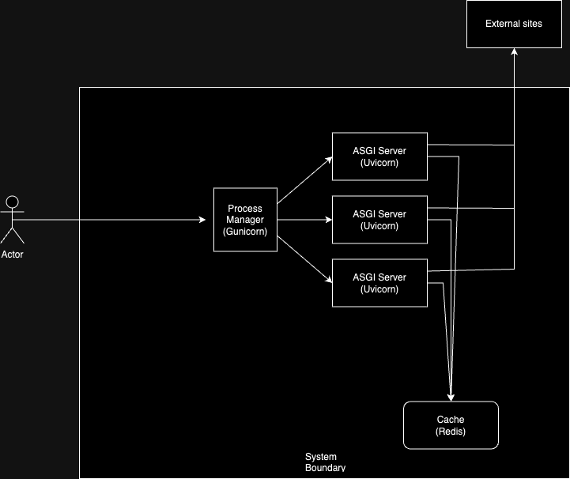

# Web Crawler Service

The service consists of a client-server architecture where the server receives a URL, crawls it, and builds a sitemap.
The service is designed to handle multiple requests efficiently using caching and asynchronous coding. The project uses
Docker and Docker Compose for containerized deployment.

## Table of Contents

- [Project Overview](#project-overview)
- [Features](#features)
- [Assumptions](#assumptions)
- [Prerequisites](#prerequisites)
- [Installation](#installation)
- [Usage](#usage)
- [Testing](#testing)
- [Project Structure](#project-structure)
- [API Endpoints](#api-endpoints)
- [Docker and Docker Compose](#docker-and-docker-compose)

## Project Overview

The web crawler service consists of a client and a server. The server crawls a given URL, scrapes the HTML content, and
builds a sitemap. It uses DFS (Depth First Search) with memoization to optimize the crawling process. The
scraped data is cached in Redis to handle repeated requests efficiently.

## Features

- Crawl URLs within a specified domain.
- Build and display a sitemap.
- Cache scraped data in Redis for faster subsequent requests.
- Containerized using Docker for easy deployment.
- Code formatted with Black for consistency.
- Linted with Pylint for code quality.
- Tested with Pytest to ensure reliability.

## Assumptions

Only clickable links (href=) are considered in the crawler; assets (e.g., images, scripts, stylesheets) are not included
in the crawl.

## Prerequisites

- Python 3.11
- have requests module
- Docker and Docker Compose

## Installation

1. Clone the repository:
   ```shell
   git clone git@github.com:VikalpRusia/webCrawler.git
   cd webCrawler
   ```
2. Build and run docker container
   ```shell
   docker compose up -d --build
   ```
3. The FastAPI server will be running at http://localhost:8000.

## Usage

1. Install requests
   ```shell
   pip install requests
   ```
2. Use client to send request to server
   ```shell
   python crawler_client.py <site>
   ```

Example - `python crawler_client.py http://localhost:8001/test`

## Testing

1. Install dev-requirements
   ```shell
   pip install -r dev-requirements.txt
   ```
2. Start redis
   ```shell
   docker compose up -d redis
   ```
3. Trigger Test cases
   ```shell
   python3 -m pytest tests
   ```

## Project Structure

```
.
├── Dockerfile                   # Dockerfile for building the FastAPI server image
├── README.md                    # Project documentation
├── app                          # Application source code
│   ├── __init__.py              
│   ├── api                      # API routes
│   │   ├── __init__.py
│   │   └── v1
│   │       ├── __init__.py
│   │       └── crawl_api.py     # API route for crawling
│   ├── config                   # Configuration files
│   │   ├── __init__.py
│   │   └── constants.py
│   ├── controllers              # Controllers for handling logic
│   │   ├── __init__.py
│   │   └── crawl_controller.py  # Controller for crawl logic
│   ├── filters                  # Filters for request processing
│   │   ├── __init__.py
│   │   ├── health_check_filter.py
│   │   └── op_filter.py
│   ├── helper                   # Helper functions
│   │   ├── __init__.py
│   │   └── redis_helper.py      # Helper for Redis operations
│   ├── middlewares              # Middlewares for request handling
│   │   ├── __init__.py
│   │   ├── time_taken_middleware.py
│   │   └── uuid_middleware.py
│   ├── schemas                  # Pydantic schemas
│   │   ├── __init__.py
│   │   └── crawl_request.py     # Schema for crawl request
│   └── main.py                  # Entry point for the FastAPI app
├── crawler_client.py            # Client script to send crawl requests
├── dev-requirements.txt         # Development dependencies
├── docker-compose.yml           # Docker Compose configuration
├── requirements.txt             # Python dependencies
└── tests                        # holds test cases

```

## API Endpoints

- **POST /api/v1/crawl**: Accepts a URL to crawl and returns the sitemap.
- **GET /health**: Checks the health of the service.

### Documentation
Swagger documentation is available at http://localhost:8000/.

## Docker and Docker Compose

The project uses Docker and Docker Compose to manage the containers for the FastAPI server and Redis.

- `docker compose up -d --build`: Build and start the containers in background.
- `docker compose down`: Stop and remove the containers.

## System Architecture

